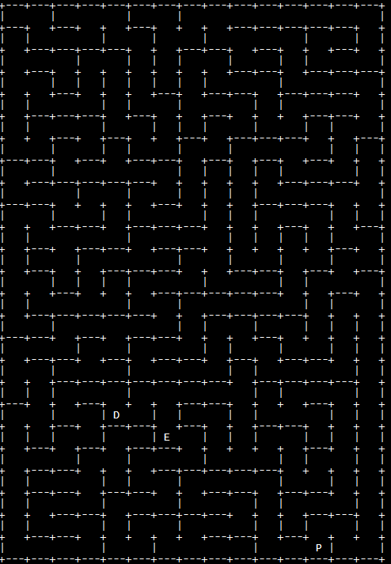

# Trustpilot Code challenge
[Challenge link](https://ponychallenge.trustpilot.com/index.html)

## Objective
*Given a random maze consisting of a 15x25 grid containing a monster find a path for the player to the exit.*

## Algorithm
The algorithm I used is based on each move to a new tile having an associated cost. Every 'round' the AI will move the player according to which move is the cheapest.
The cost consists of 4 different values:

| Name                     | Value range                                          	 |
| ------------------------ | ------------------------------------------------------- |
| Distance to exit         | \[0 -> `sqrt(maze_width ** 2 + maze_heightn ** 2)`\]    |
| Trail penalty            | \[0 -> 100\]                                            |
| Monster vicinity penalty | \[999999 -> 999999\]                                    |
| Wall penalty             | \[9999->9999\]                                          |

These costs ensure the following:
* If all else is equal the move, which  brings the player closer to the exit will be picked
* Given two equal options for moving, where one has been visited previously the "undiscovered" move will be picked
* If a move brings the player next to the monster it will be considered a  virtually impossible move.
* Likewise, moving into a wall is also virtually impossible, but significantly more likely than walking into the monster

## Demo

## Usage
Make sure all requirements from the [requirements file](requirements.txt) are installed using `pip install <requirement>`

### Solving a maze
To solve a maze execute the command `python solve.py`. The result will be placed on the Desktop. 

### Viewing a replay
Everytime a maze is being solved a replay is saved to the users Desktop. To view the replays execute `python view_maze.py` and input the desired ID from the menu into the prompt. 
